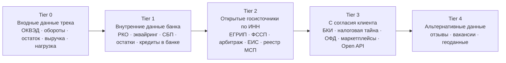

# Какие данные банк может получить о клиенте и что из них вытянуть

> Ресёрч к вопросу: «какую информацию банк может найти, зная персональные данные клиента, и что из этого полезно для подбора идеального предложения».

## TL;DR

1. **Самые ценные данные у банка уже есть**: это выписка по расчётному счёту (РКО), эквайринг и СБП. По ним видно выручку, сезонность, расходы, зарплаты, налоги и даже **скрытые долги в других банках** (по назначениям платежей). Отсюда получаем точный лимит без анкеты.
2. **Открытые госреестры по ИНН** (ЕГРЮЛ/ЕГРИП, ФССП, арбитраж, банкротства, госзакупки, реестр МСП) дают стоп-факторы, верификацию и **сигналы потребностей**. Пример: участие в госзакупках → банковская гарантия.
3. **С согласия клиента** открываются БКИ, налоговая тайна, кассы (ОФД), маркетплейсы и **счета в других банках через Open API** (обязательны для крупнейших банков с 2026 года). Это основа фичи «подключи данные — получи условия лучше».
4. Входные данные трека (ОКВЭД, обороты, остаток, выручка, кредитная нагрузка) — это **агрегаты**. Архитектура должна работать и на них одних (Tier 0), и на полном наборе. Поэтому модель обучаем так, чтобы она терпела пропуски (CatBoost нативно работает с NaN).

## Уровни данных

Уровни повторяют юридическую основу доступа и прямо ложатся на **маску согласий** в признаках (см. [features.md](../05-ml/features.md)).



### Tier 0. Входные данные трека

| Поле | Как трактуем | Ограничение |
|---|---|---|
| ОКВЭД | Основной код + дополнительные | По нему отраслевой риск, сезонность, госпрограммы |
| Обороты месяц/год | Сумма всех поступлений | Нужно отделять выручку от транзита и займов |
| Остаток на счёте ИП | Баланс на дату | Одной точки мало, нужна динамика |
| Выручка | Поступления от продаж | Если есть только годовая, сезонность не видна |
| Кредитная нагрузка | Платежи по долгам / выручка | Неизвестно, учтены ли долги в других банках |

**Вывод:** на Tier 0 можно дать грубую оценку (лимит и риск-грейд), а настоящая магия начинается с Tier 1.

### Tier 1. Внутренние данные банка (в рамках договора обслуживания)

| Источник | Что получаем | Что вытягиваем | Для чего |
|---|---|---|---|
| **Выписка РКО** (все входящие и исходящие платежи) | Дата, сумма, ИНН и название контрагента, назначение платежа | Категоризация операций (выручка, поставщики, ФОТ, налоги, аренда, кредиты, лизинг); структура расходов; FCF; контрагенты | Лимит, ставка, тип продукта, стоп-факторы |
| **Эквайринг** (торговый и интернет) | Ежедневные возмещения, количество операций | Дневная выручка, средний чек, тренд, сезонность, дни недели | Лимит овердрафта и кредита, кредит под эквайринг |
| **СБП-платежи (QR)** | Поступления от физлиц | То же, что эквайринг; доля СБП | Выручка |
| **Остатки на счетах** по дням | Ежедневный баланс | Средний и минимальный остаток, число дней с остатком < 10% месячных расходов, волатильность | Овердрафт, прогноз кассового разрыва |
| **Кредиты в нашем банке** | Лимиты, использование, просрочки | Платёжная дисциплина, утилизация овердрафта | PD, повторные продажи |
| **Зарплатный проект** | Выплаты сотрудникам | Численность, стабильность ФОТ | Масштаб бизнеса, устойчивость |
| **Валютный контроль / ВЭД** | Валютные контракты | Импорт или экспорт | Валютные продукты, аккредитивы (вне скоупа) |
| **Поведение в ИБ / МП** | Частота входов, используемые сервисы, поиск по продуктам | Интерес к продуктам, вовлечённость | Таргетинг оффера (intent) |
| **Владелец ИП как физлицо** (если клиент банка) | Карты, кредиты, ипотека, доходы | Личная долговая нагрузка, изъятие прибыли из бизнеса | ИП отвечает личным имуществом, поэтому важно для PD. Нужно согласие на обработку ПДн в этих целях |

### Tier 2. Открытые государственные источники (по ИНН, без согласия)

| Источник | Что получаем | Что вытягиваем | Для чего |
|---|---|---|---|
| **ЕГРЮЛ / ЕГРИП** (ФНС) | Дата регистрации, ОКВЭД основной и доп., адрес, руководители и учредители, статус | Возраст бизнеса, массовый адрес или руководитель, признак недостоверности, смена ОКВЭД | Стоп-факторы, верификация, автозаполнение заявки |
| **Реестр МСП** (rmsp.nalog.ru) | Категория (микро/малое/среднее), численность | Допуск к госпрограммам | Госпрограммы, зонтичные поручительства |
| **Реестр получателей поддержки МСП** | Полученная господдержка | Уже получал льготный кредит или грант | Госпрограммы (лимиты на повторное участие) |
| **Открытые данные ФНС** | Налоговый режим, уплаченные налоги, недоимки, среднесписочная численность, доходы и расходы по отчётности | Налоговая дисциплина, масштаб | PD, стоп-факторы (недоимка) |
| **Сервис ФНС о блокировках счетов** (bi.nalog.ru) | Действующие решения о приостановлении операций | Стоп-фактор | Стоп-фактор |
| **ГИР БО** (bo.nalog.ru), только ООО | Баланс, ОФР за годы | Выручка, прибыль, активы, долги | Лимит для ООО, верификация |
| **ФССП** (банк исполнительных производств) | Исполнительные производства | Долги по суду, их сумма и динамика | PD, стоп-фактор при крупных суммах |
| **Картотека арбитражных дел** (kad.arbitr.ru) | Иски как ответчик или истец | Суммы исков к клиенту, споры с контрагентами | PD |
| **ЕФРСБ / Федресурс** | Банкротство, намерения кредиторов, сообщения о лизинге и залогах | Скрытые лизинговые обязательства, банкротные риски | Стоп-фактор, долговая нагрузка |
| **Реестр уведомлений о залоге движимого имущества** (ФНП) | Залоги | Что уже заложено | Залоговые продукты |
| **ЕИС госзакупок** (zakupki.gov.ru) + **РНП** | Контракты 44/223-ФЗ, участие в торгах, недобросовестность | Выручка от госзаказа, будущие поступления, потребность в гарантиях | **Банковская гарантия, тендерный кредит, факторинг** |
| **Платформа ЗСК** (Банк России) | Уровень риска по 115-ФЗ: низкий / средний / высокий | Риск блокировок | Стоп-фактор при «красном» |
| **Росстат, отраслевая статистика** | Отраслевые индексы, сезонность | Отраслевой риск, норма маржи по ОКВЭД | Отраслевые признаки, валидация синтетики |

### Tier 3. С согласия клиента

| Источник | Что получаем | Что вытягиваем | Для чего | Как получить согласие |
|---|---|---|---|---|
| **БКИ** (НБКИ, ОКБ, Скоринг Бюро, Кредитинфо) | Кредитная история бизнеса и владельца, скоринги бюро | **Все** долги в других банках и МФО, просрочки, частота запросов (кредитный голод) | PD, лимит, стоп-факторы | Согласие на запрос КИ (218-ФЗ), галочка в заявке |
| **Налоговая тайна** (согласие в ФНС, форма по приказу ЕД-7-19/1085@) | Декларации, сальдо ЕНС, расчёты | Подтверждённая выручка (особенно для новых клиентов без истории РКО) | Лимит для «чужих» клиентов | Электронно с ЭП через ЛК ФНС или ЭДО. Можно на часть сведений и на срок |
| **ОФД** (данные онлайн-касс) | Все чеки: сумма, время, номенклатура, точки продаж | Точная выручка включая наличные, средний чек, ассортимент, число точек | **Лимит выше**, ставка ниже, кредит под выручку касс | Клиент указывает своего ОФД в кабинете, данные идут в банк (так работают Модульбанк и Контур.ОФД) |
| **Маркетплейсы** (WB, Ozon, ЯМ — read-only API-токен продавца) | Продажи, остатки, выкупы, рейтинг, график выплат | Выручка на маркетплейсах, оборачиваемость, сезонные пики | **Кредит селлерам под выручку маркетплейса**, факторинг | Клиент вставляет токен с правами «только статистика» |
| **Open API других банков** (стандарт ЦБ, обязателен для крупнейших банков с 2026) | Счета, остатки, операции в других банках | Полная картина оборотов и долгов | Лимит, нагрузка, переманивание оборотов | Согласие через Open API. Банк России и Минцифры готовят Платформу коммерческих согласий |
| **1С / облачная бухгалтерия** (1С:ДиректБанк, API) | Дебиторка, кредиторка, план закупок | Будущие поступления и платежи | Прогноз кассового разрыва, факторинг | OAuth / интеграция |
| **Госуслуги («цифровой профиль»)**, для ИП как физлица | Доходы, недвижимость, транспорт | Личные активы ИП | Обеспечение, PD | Согласие через ЕСИА |

### Tier 4. Альтернативные данные

| Источник | Что вытягиваем | Применимость |
|---|---|---|
| Отзывы и рейтинг на картах (2ГИС, Яндекс Карты) | Здоровье бизнеса B2C: HoReCa, салоны, СТО. Динамика числа отзывов как прокси трафика | P2, хорош для питча |
| Вакансии (hh.ru и др.) | Рост бизнеса (нанимают значит растут), зарплатный уровень | P2 |
| Сайт, домен, соцсети | Существование и активность бизнеса | P2 |
| Геоданные / трафик локации | Потенциал точки (новая кофейня) | Только питч |

## Что можно вытянуть из одной только выписки

Это главный слайд для жюри: **«банк знает о бизнесе больше, чем анкета»**.

| Паттерн в транзакциях | Как распознаём | Инсайт | Продукт / действие |
|---|---|---|---|
| Ежедневные возмещения эквайринга, СБП | Контрагент — банк-эквайер, назначение «возмещение по операциям…» | Дневная выручка, средний чек, сезонность по дням недели | Лимит кредита и овердрафта, **кредит под эквайринг** |
| Еженедельные выплаты от WB, Ozon, ЯМ | ИНН маркетплейса в справочнике | Клиент — **селлер** | **Кредит под выручку маркетплейса**, факторинг |
| Поступления от бюджетных учреждений, УФК | ИНН заказчика из ЕИС, «УФК по…» в назначении | **Госзаказ** | **Банковская гарантия**, тендерный кредит |
| Поступления от юрлиц с задержкой 30–90 дней после отгрузки | Счета и акты в назначениях, регулярные B2B-покупатели | Дебиторка, отсрочки | **Факторинг**, ВКЛ |
| «Погашение кредита / процентов по договору…» в **другие банки** | Регулярный платёж на ИНН банка + ключевые слова | **Скрытая долговая нагрузка** | Пересчёт нагрузки, рефинансирование |
| «Лизинговый платёж по договору…» | ИНН лизинговой компании | Лизинг у конкурента | Нагрузка; новый лизинг у нас |
| Переводы в МФО | ИНН из реестра МФО | **Красный флаг**: кредитный голод | Снижение лимита, ответственный отказ |
| Зарплата 2 раза в месяц + НДФЛ / ЕНП | Назначения «заработная плата», «аванс» | Численность, ФОТ, дисциплина | Масштаб, устойчивость |
| ЕНП в срок (28-го числа) | ИНН ФНС / казначейства | Налоговая дисциплина. Пики налогов — **известные будущие списания** | Прогноз кассового разрыва |
| Аренда раз в месяц | «Аренда помещения по договору…» | Фиксированные расходы | FCF, прогноз |
| Предоплата поставщику оборудования или автодилеру | ОКВЭД контрагента 46.6x / 45.1x, ключевые слова | **Намерение capex** прямо сейчас | **Кредит на оборудование, лизинг** |
| Закупки перед сезоном (рост выплат поставщикам за 1–2 месяца до пика) | Сезонный паттерн исходящих платежей | Цикличная потребность в оборотке | **ВКЛ**, сезонный график |
| Остаток < 10% месячных расходов N дней в месяц | Ряд остатков | Хроническая нехватка ликвидности | **Овердрафт** |
| Рост выручки +15%+ квартал к кварталу | Тренд | Бизнес растёт, ему нужен капитал | Проактивный оффер «вам доступно до…» |
| Регулярные переводы на личную карту владельца | Получатель — ФЛ с ФИО владельца | Изъятие прибыли | FCF (дивиденды не операционный расход) |
| Крупное снятие наличных, транзит (пришло и в тот же день ушло) | Доля cash-out, лаг поступление → списание | Риск по 115-ФЗ | Стоп-фактор / ручная проверка |
| Концентрация покупателей (1 покупатель > 50% выручки) | HHI по контрагентам | Риск потери ключевого клиента | Премия за риск, факторинг |

## Производные метрики

Полный каталог с формулами — в [features.md](../05-ml/features.md). Ключевые:

```
revenue_m          = Σ поступлений категории «выручка» за месяц
revenue_growth_qoq = revenue(последние 3 мес) / revenue(предыдущие 3 мес) − 1
seasonality_idx[m] = revenue_m / среднее(revenue) по календарному месяцу
revenue_cv_12m     = std(revenue_m) / mean(revenue_m) за 12 мес
fcf_m              = операционные поступления − операционные списания (без кредитов, переводов себе, дивидендов)
debt_service_m     = Σ платежей по кредитам и лизингу (наш банк + распознанные в выписке + БКИ)
credit_load        = debt_service_m / revenue_m
dscr               = fcf_m / debt_service_m
low_balance_days   = число дней в месяце, где balance < 0.1 × месячные расходы
customer_hhi       = Σ (доля покупателя)²
cash_out_share     = снятия наличных и переводы ФЛ / обороты
```

## Правовые рамки (коротко)

| Аспект | Норма | Что делаем в продукте |
|---|---|---|
| Банковская тайна | Ст. 26 закона «О банках и банковской деятельности» | Внутренние данные используем только для обслуживания клиента |
| Персональные данные | 152-ФЗ | Согласие на обработку в целях подбора продуктов, минимизация данных, PII не уходит во внешние LLM ([security.md](../03-architecture/security.md)) |
| Кредитные истории | 218-ФЗ | Запрос в БКИ только с явного согласия (экран «Данные и согласия») |
| Налоговая тайна | НК РФ ст. 102, форма согласия ЕД-7-19/1085@ | Кнопка «Передать данные из ФНС» с пояснением |
| Open API | Концепция Банка России, обязательность с 2026 | Кнопка «Подключить счёт в другом банке» (mock) |
| 115-ФЗ | Платформа ЗСК | Красный уровень — стоп-фактор |

## Как эмулируем на хакатоне

- Все источники Tier 2–3 эмулируются как **снимки** в таблице `bank.ext_snapshots (client_id, source, fetched_at, payload jsonb)`. У каждого источника своя схема (Go-структура + proto-сообщение в `ClientDataBundle`) ([data-model.md](../03-architecture/data-model.md)).
- Генератор синтетики создаёт снимки, **согласованные** с транзакциями и скрытым риском клиента. Пример: у персоны «Салон» есть платежи в МФО, недоимка в ФНС и производство в ФССП ([data-generation.md](../05-ml/data-generation.md)).
- Каждый источник Tier 3 доступен признакам, только если в `core.consents` есть активное согласие. Отзыв согласия → пересчёт офферов.
- На экране «Финансы бизнеса → Данные и согласия» клиент видит список источников, что из них используется и какой прирост лимита или ставки даст подключение.

## Источники

- Что банки смотрят у ИП при скоринге: [Т-Бизнес секреты](https://secrets.tbank.ru/biznes-s-nulya/skoring-v-banke/), [ВТБ словарь](https://www.vtb.ru/malyj-biznes/biznes-slovar/kredity/skoring/), [FutureBanking: где взять данные для скоринга](https://futurebanking.ru/post/3602)
- API к ЕГРЮЛ/ЕГРИП и проверка контрагентов: [api-fns.ru](https://api-fns.ru/api_help), [checko.ru](https://checko.ru/integration/api), [Корпорация МСП: проверка контрагентов по 20+ параметрам](https://corpmsp.ru/about/press/news/novosti-korporatsii/korporatsiya_msp_na_osnovanii_dannykh_fns_zapustila_servis_po_proverke_kontragentov_po_bolee_chem_20/)
- Платформа ЗСК: [Банк России](https://cbr.ru/counteraction_m_ter/platform_zsk), [разбор критериев](https://shupikov.com/razblokirovka/zsk-cb-spisok-kriteriev-zelenaya-zheltaya-krasnaya-zona)
- Согласие на раскрытие налоговой тайны: [Гарант](https://www.garant.ru/news/1064991/), [Контур](https://e-kontur.ru/blog/15912/soglasie-na-raskrytie-nalogovoj-tajny)
- Открытые API: [Банк России: «Открытые API: новые возможности»](https://www.cbr.ru/press/event/?id=20968), [TAdviser](https://www.tadviser.ru/index.php/%D0%A1%D1%82%D0%B0%D1%82%D1%8C%D1%8F:Open_Bank_System_(%D0%9E%D1%82%D0%BA%D1%80%D1%8B%D1%82%D0%B0%D1%8F_%D0%B1%D0%B0%D0%BD%D0%BA%D0%BE%D0%B2%D1%81%D0%BA%D0%B0%D1%8F_%D0%BF%D0%BB%D0%B0%D1%82%D1%84%D0%BE%D1%80%D0%BC%D0%B0))
- Кредит под оборот онлайн-касс (ОФД): [Контур.ОФД × Модульбанк](https://kontur.ru/ofd/news/6989)
- Кредиты селлерам под выручку маркетплейсов: [trillioncredit](https://www.trillioncredit.ru/blog/kredit-pod-vyruchku-marketpleysa/), [Точка](https://tochka.com/rko/marketplace-products/)
- Кредитные истории юрлиц и скоринг ИП: [НБКИ](https://nbki.ru/judicial/), [НБКИ: скоринги](https://corp.nbki.ru/services/bank/scores/)
