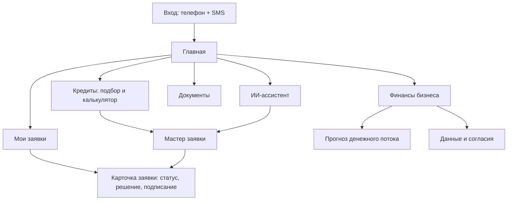
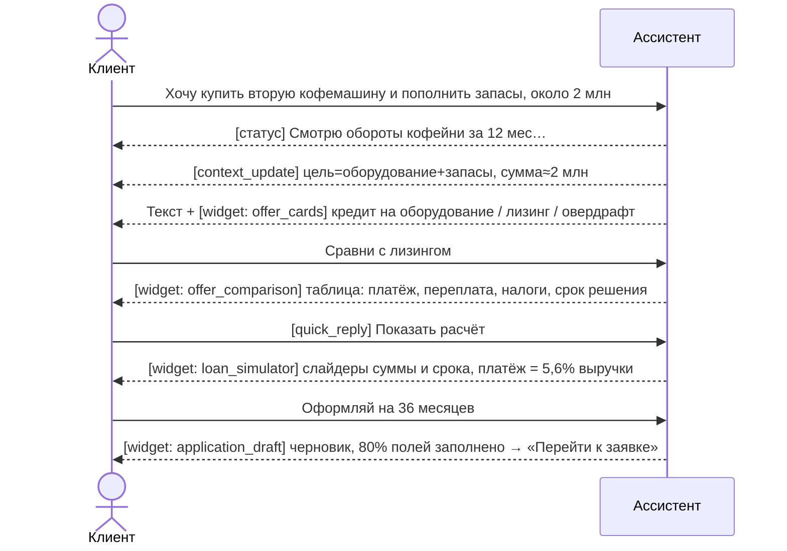

# Экраны и пользовательские сценарии

## Карта экранов

Навигация из дизайна сохранена, пункт «Финансы бизнеса» получает смысл: прогноз денег + данные и согласия.

## Экраны: что оставляем, что добавляем

| Экран | Назначение | Данные (API) | Правки к дизайну |
|---|---|---|---|
| **Вход** | Телефон → SMS-код | `POST /auth/otp`, `POST /auth/verify` | Новый экран. Чипы «Демо-клиенты» с персонами (подставляют номер), тост «SMS: 4821» |
| **Главная** | Сводка + проактивные предложения | `GET /dashboard` (одним запросом) | Оставляем: баннер ИИ-предложения, выручку с графиком, рекомендации, заявки, остаток и нагрузку. **Добавляем**: виджет «Прогноз на 30 дней» с алертом о разрыве и CTA «Закрыть овердрафтом», карточку «Подключите данные → +X ₽ к лимиту». **Меняем**: «Скоринговый балл 814» → «Финансовое здоровье 814/1000» с подсказкой, как улучшить (внутренний скор клиенту не показываем) |
| **ИИ-ассистент** | Диалог о потребности → оффер → заявка | `POST /chat/sessions/{id}/messages` (SSE) | Оставляем: правую панель «Что я понял о вас» (обновляется событиями `context_update`), рекомендуемый продукт, «Почему именно он». **Добавляем**: виджеты в ленте (карточки офферов, слайдер-калькулятор, график, черновик заявки), статусы инструментов («Анализирую выписку за 12 мес…»), переключатель «Как думает ассистент» |
| **Кредиты (подбор)** | Сравнение 3 лучших вариантов + калькулятор | `GET /offers`, `POST /offers/simulate` | Оставляем: слайдеры суммы и срока, цель, 3 карточки, совет ИИ. **Добавляем**: бейдж «Господдержка» с экономией, переключатель «Сезонный график», мини-график платежей в карточке, «Как повысить шанс» |
| **Мастер заявки** | 4 шага: параметры → данные бизнеса → документы → подписание | `POST /applications`, `PATCH /applications/{id}`, `POST /applications/{id}/documents` | Оставляем: шаги, бейджи «авто», «по выписке», дропзону счёта, плашку «Не нужно загружать». **Добавляем**: после загрузки счёта поля поставщика и суммы заполняются сами + бейдж «Поставщик проверен по ЕГРЮЛ» |
| **Карточка заявки** | Статус, решение, подписание, график | `GET /applications/{id}`, SSE `/events` | Оставляем: hero «Одобрено», «Почему одобрено», таймлайн статусов. **Меняем**: «Почему одобрено» → бары SHAP со знаком (+/−). График платежей: **вариант 2 из дизайна** (подписи с суммами), для сезонного графика столбцы разной высоты (так видна ценность). Добавляем разбивку «основной долг / проценты» |
| **Мои заявки** | Список заявок | `GET /applications` | Простой список со статусами |
| **Документы** | Загруженные и сформированные документы | `GET /documents` | Список + скачивание (договор — mock-PDF) |
| **Финансы бизнеса → Прогноз** | Денежный поток: факт 90 дней + прогноз 60 дней с коридором | `GET /finance/cashflow` | Новый экран. График ECharts: факт, прогноз, коридор, отметки известных платежей (налоги, аренда, ЗП), красная зона разрыва |
| **Финансы бизнеса → Данные и согласия** | Какие источники подключены, что дают | `GET /consents`, `POST /consents/{source}` | Новый экран. Карточки источников (БКИ, ФНС, ОФД, маркетплейсы, другие банки): статус, «что используем», «+X ₽ к лимиту / −Y п.п. к ставке» |

## Ключевые сценарии

### F1. Вход
Телефон → код из «SMS» → главная. Ошибка кода: 3 попытки, затем блок на 1 минуту.

### F2. Проактивный оффер с главной
Главная показывает баннер «Вам доступно до 3 500 000 ₽» и алерт «Через 23 дня возможен кассовый разрыв 180 000 ₽». Клик по «Подобрать кредит» ведёт на экран «Кредиты» с предзаполненной целью. Клик по «Закрыть овердрафтом» открывает мастер с продуктом `overdraft` и суммой разрыва × 1,2.

### F3. Диалог → оффер → заявка (главный сценарий)

Ассистент **не отправляет** заявку сам: создаёт черновик, а отправку подтверждает пользователь кнопкой.

### F4. Подбор и калькулятор
Пользователь двигает слайдеры, фронт с debounce 250 мс вызывает `POST /offers/simulate`, карточки пересчитываются: платёж, вероятность одобрения, переплата. «Совет ИИ» — это текст, собранный по шаблону из результатов симуляции (без LLM, чтобы не тормозило).

### F5. Заявка от черновика до денег
Черновик → проверка данных → загрузка счёта (P1) → «Отправить» → таймлайн в реальном времени: *Заявка подана → Проверка данных → Скоринг ИИ → Решение банка* → «Одобрено» → «Подписать договор» → SMS-код → «Выдача средств» → на главной остаток +2 000 000 ₽, в истории новая транзакция.

### F6. Кассовый разрыв
«Финансы бизнеса → Прогноз»: на графике красная зона. Карточка: «Разрыв 180 000 ₽ 29 октября. Причины: квартальная закупка зерна 450 000 ₽, авансовый платёж по УСН 96 000 ₽, конец сезона веранды (−15% выручки)». CTA ведёт на овердрафт.

### F7. Подключение данных (P1)
«Данные и согласия» → «Подключить ОФД» → модалка согласия (что передаём, срок, отзыв) → «Согласен» → офферы пересчитаны → тост «Лимит вырос до 4 100 000 ₽, ставка −0,5 п.п.».

### F8. Ответственный отказ (P1, персона «Салон»)
Запрос 1,5 млн → ассистент показывает вероятность ~12%, факторы (МФО, недоимка, ФССП), встречный оффер и план из 3 шагов с эффектом каждого.

## Состояния, о которых часто забывают

- **Загрузка ассистента**: первые токены приходят за 1–3 с, до этого показываем статусы инструментов.
- **LLM недоступна**: ассистент показывает «Я временно недоступен», остальной кабинет работает (офферы и калькулятор от LLM не зависят).
- **Пустые состояния**: нет заявок, нет согласий.
- **Ошибки сети в SSE**: автопереподключение с `Last-Event-ID`.
