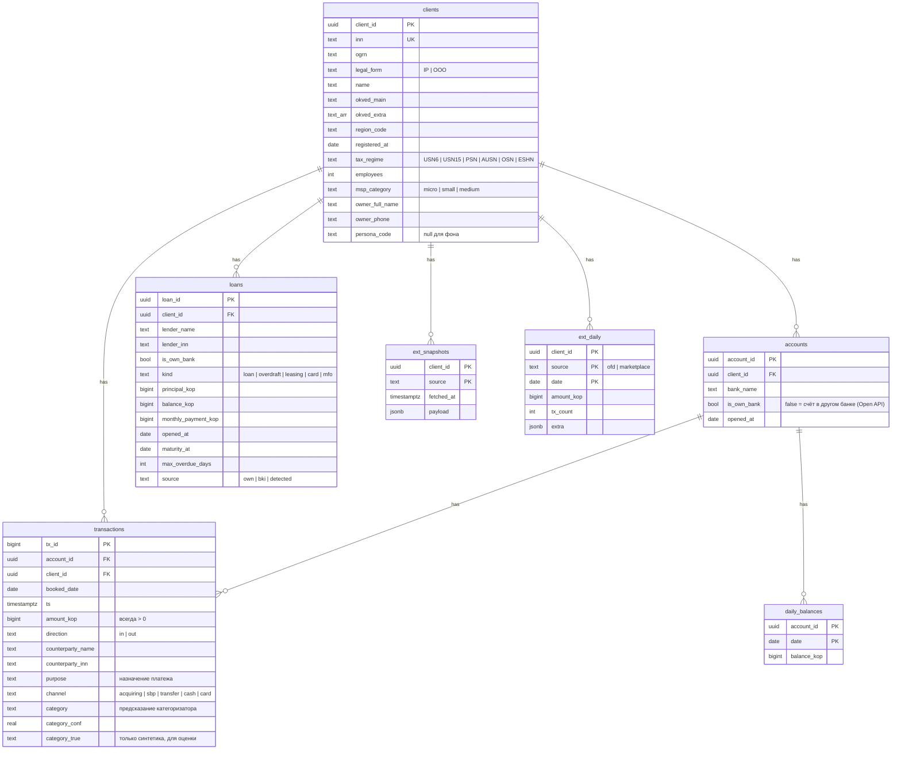
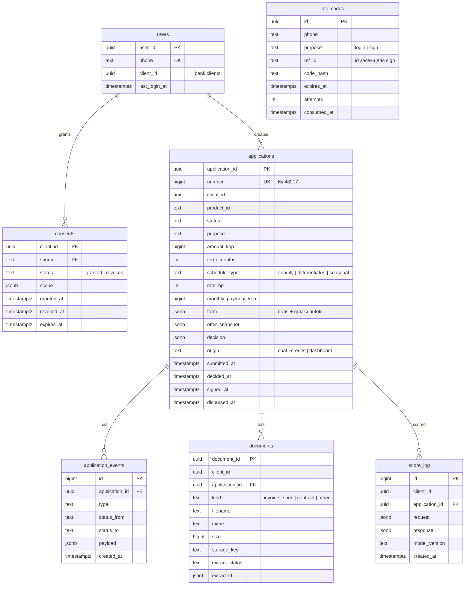
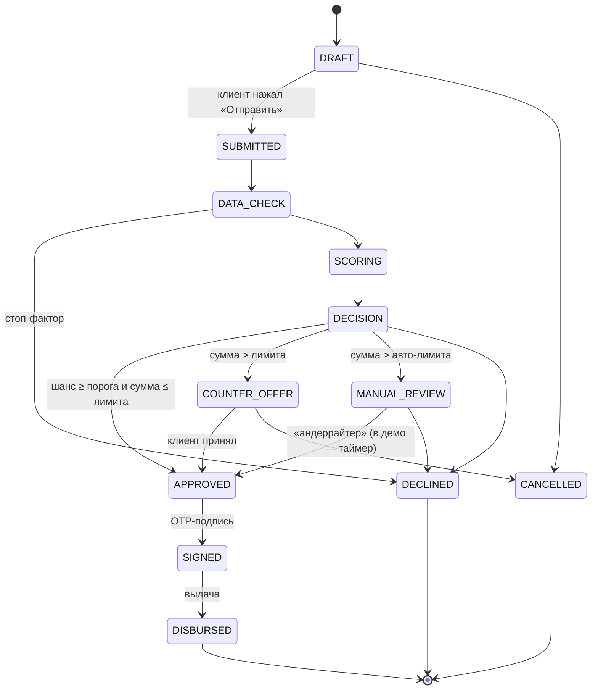

# Модель данных

Один PostgreSQL 16 (+ pgvector), три схемы с явными владельцами.

| Схема | Что это | Пишет | Читает |
|---|---|---|---|
| `bank` | **Эмуляция данных банка и внешних источников**: клиенты, счета, транзакции, остатки, кредиты, снимки внешних источников | `datagen` (офлайн). Исключение: core при выдаче кредита (эмуляция АБС) | `core` (адаптер `bankdata`) |
| `core` | Данные кабинета: пользователи, OTP, согласия, заявки, документы, уведомления, аудит, лог скоринга, таблицы River | `core` | `core` |
| `assistant` | Сессии чата, сообщения, база знаний с эмбеддингами | `core` (модуль `assistant`) | `core` |

Python-сервис `ml` в БД **не ходит** ([ADR-0003](adr/0003-go-logic-python-models.md)).

## Соглашения

- **Деньги — `bigint` в копейках** (`amount_kop`). Никаких `numeric` / `float` в Go-коде для сумм.
- **Ставки — `int` в базисных пунктах** (`rate_bp`: 1650 = 16,50%).
- Время — `timestamptz` (UTC). Бизнес-даты операций — `date`.
- Идентификаторы — `uuid` (v7, сортируемые). Человекочитаемый номер заявки — отдельная sequence (`№ 48217`).
- Статусы — Postgres `enum` либо `text` + `CHECK`. Выбираем `text` + `CHECK`: проще миграции.
- Гибкие части (снимки внешних источников, форма заявки, виджеты сообщений) — `jsonb` со схемой в коде.

## Схема `bank`



Дополнительно:
- `bank.counterparty_registry (inn PK, name, okved, kind, status, registered_at, flags jsonb)` — справочник контрагентов: маркетплейсы, банки, МФО, лизинговые компании, госзаказчики, поставщики оборудования. Нужен для категоризации и проверки поставщика из счёта.
- `bank.meta (key PK, value)` — `demo_today`, `dataset_version`, `seed`, `source` (`synthetic` | `<adapter>`).

### Источники в `ext_snapshots.source`

| source | Tier | Нужно согласие | Ключевые поля `payload` |
|---|---|---|---|
| `egr` | 2 | нет | дата регистрации, ОКВЭД, адрес, массовый адрес, недостоверность, руководители |
| `rmsp` | 2 | нет | категория МСП, численность, получатель поддержки |
| `fns_open` | 2 | нет | режим налогообложения, уплачено налогов за год, недоимка |
| `fns_blocks` | 2 | нет | действующие решения о приостановлении |
| `fssp` | 2 | нет | список производств: сумма, дата, предмет |
| `arbitr` | 2 | нет | дела: роль, сумма, статус |
| `fedresurs` | 2 | нет | банкротство, сообщения о лизинге и залогах |
| `eis` | 2 | нет | контракты: заказчик, сумма, сроки, статус; РНП |
| `zsk` | 2 | нет | уровень риска: `low` / `medium` / `high` |
| `bki` | 3 | **да** | кредиты и займы, просрочки, запросы за 30/90 дней, скор бюро |
| `fns_tax_secret` | 3 | **да** | доходы по декларациям, сальдо ЕНС |
| `ofd` | 3 | **да** | агрегаты по кассам (ряды в `ext_daily`), средний чек, число точек |
| `marketplace` | 3 | **да** | площадки, выручка (ряды в `ext_daily`), рейтинг, остатки |
| `openapi_bank` | 3 | **да** | счета в других банках (сами транзакции лежат в `transactions` с `is_own_bank=false`) |

Для каждого `source` есть Go-структура в `adapters/bankdata/ext/` и соответствующее proto-сообщение в `ClientDataBundle`.

## Схема `core`



Также: `sms_outbox` (mock SMS), `notifications`, `audit_log (id, client_id, actor: user|assistant|system, action, details jsonb, created_at)` и таблицы River (создаются миграцией River).

### Статусы заявки



Каждый переход пишет строку в `application_events`. Таймлайн на экране — это проекция событий. Переходы выполняет **только** `application.StateMachine`, прямых `UPDATE status` нет.

## Схема `assistant`

| Таблица | Поля | Назначение |
|---|---|---|
| `sessions` | `session_id`, `client_id`, `title`, `slots jsonb`, `created_at`, `updated_at` | Сессия и состояние диалога (что понял ассистент) |
| `messages` | `message_id`, `session_id`, `role` (user / assistant / tool), `content`, `widgets jsonb`, `tool_calls jsonb`, `trace jsonb` (модель, токены, латентность, вызовы), `created_at` | История. Из `trace` строится режим прозрачности |
| `kb_chunks` | `chunk_id`, `doc_path`, `title`, `content`, `embedding vector(1024)`, `tsv tsvector`, `doc_hash` | База знаний для RAG: HNSW-индекс по `embedding` + GIN по `tsv` (гибридный поиск) |

## Индексы, которые нужны с первого дня

```sql
CREATE INDEX ON bank.transactions (client_id, booked_date);
CREATE INDEX ON bank.transactions (client_id, category, booked_date);
CREATE INDEX ON core.applications (client_id, created_at DESC);
CREATE INDEX ON core.application_events (application_id, id);
CREATE INDEX ON assistant.messages (session_id, created_at);
CREATE INDEX ON assistant.kb_chunks USING hnsw (embedding vector_cosine_ops);
CREATE INDEX ON assistant.kb_chunks USING gin (tsv);
```

## Объёмы

В Postgres загружаются 8 персон и ~200 фоновых клиентов: 24 мес × ~5 операций в день ≈ 0,7–1 млн строк `transactions`. Для этого объёма Postgres справляется без партиционирования. Полная обучающая выборка (тысячи клиентов) живёт в parquet и в БД не грузится.
