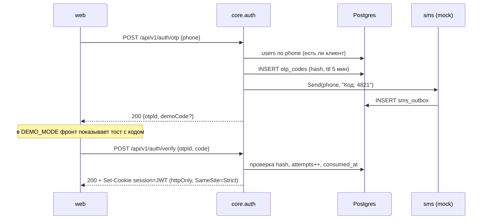
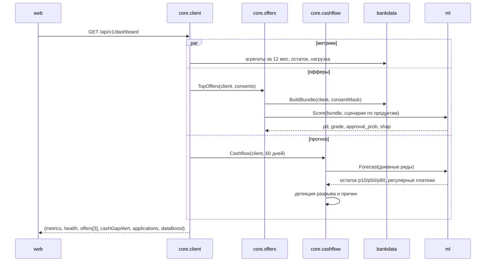
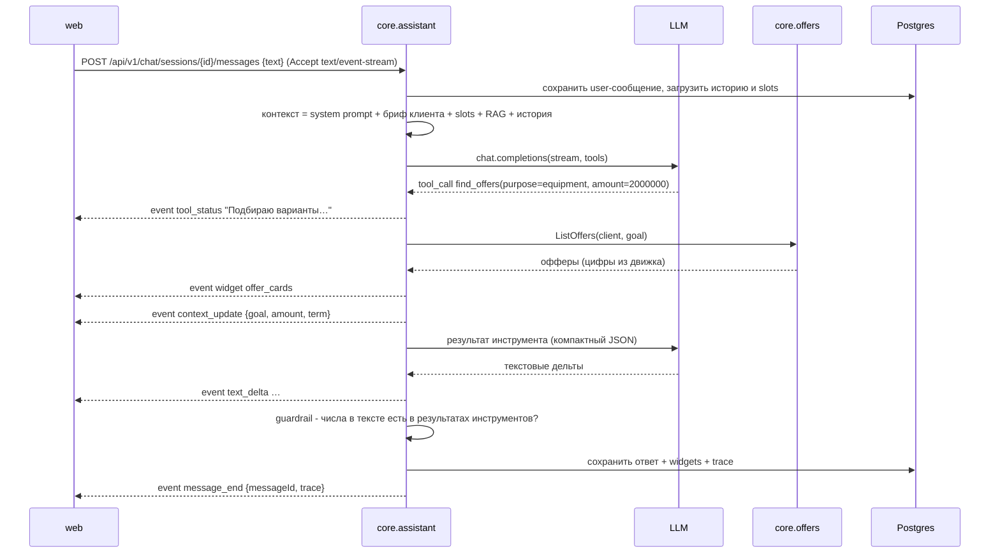
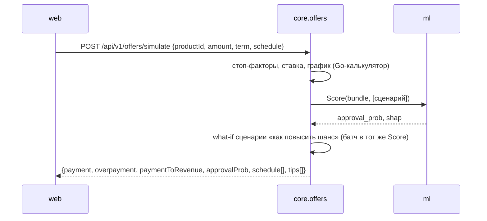
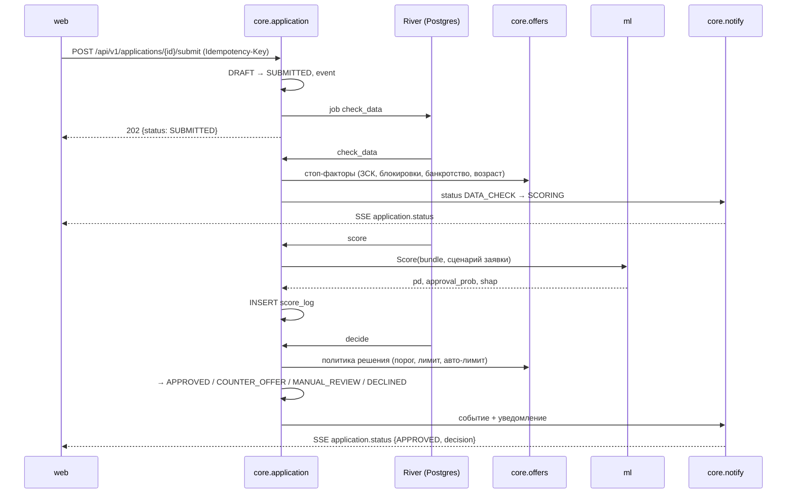
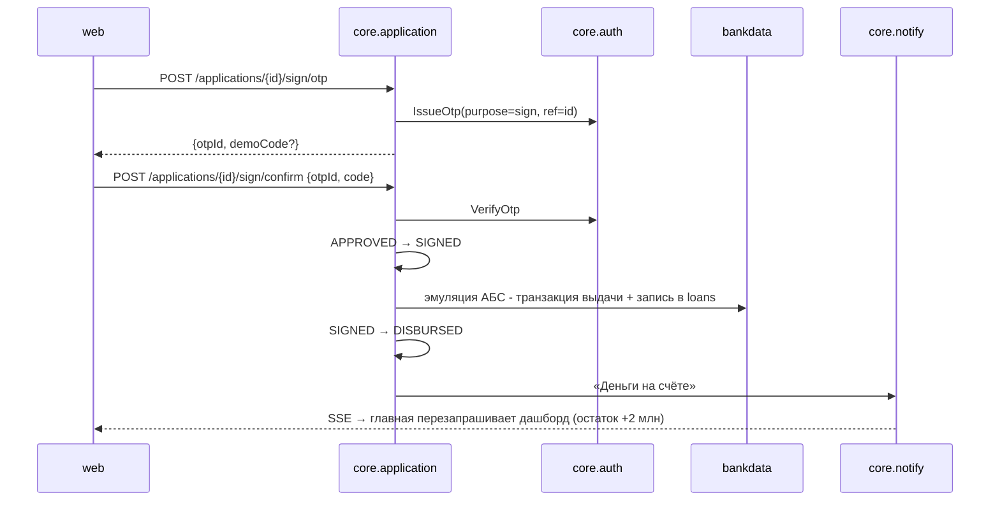
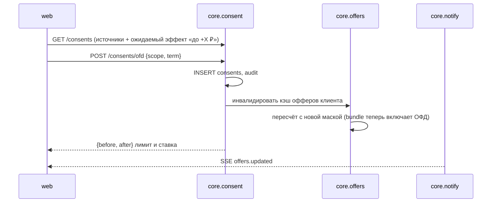
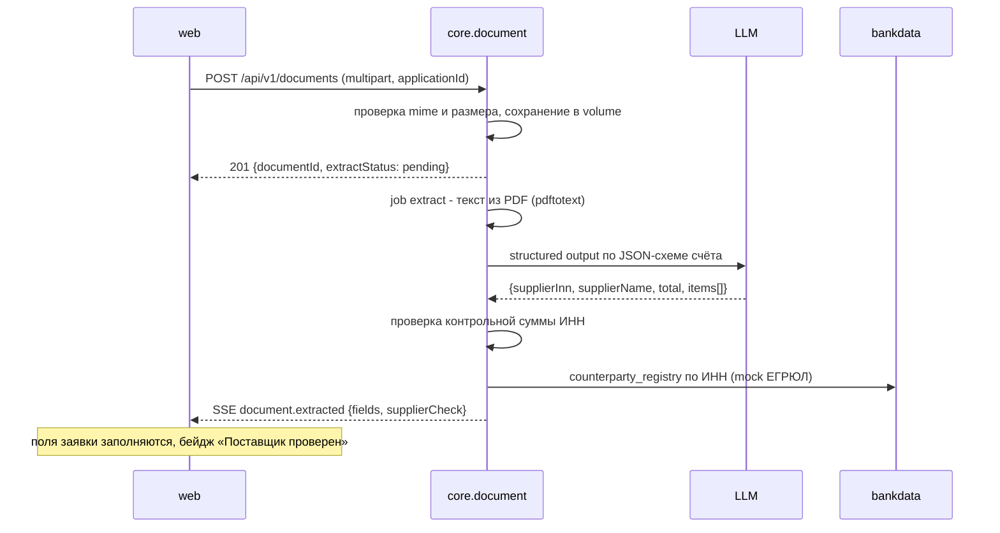

# Ключевые сценарии (sequence-диаграммы)

Обозначения: `W` — web (Vue), `C` — core (Go), `ML` — ml (Python), `L` — LLM, `DB` — Postgres.

## 1. Вход по телефону

## 2. Главная (дашборд одним запросом)

Результат кэшируется in-memory на 60 с по ключу `(client_id, consent_hash)` и сбрасывается при смене согласий или статуса заявки.

## 3. Сообщение ассистенту (tool calling + виджеты)

Если guardrail нашёл число, которого нет в результатах инструментов, ответ перегенерируется один раз со строгой инструкцией. Если и это не помогло, отправляется безопасный шаблон ([ai-assistant.md](ai-assistant.md#guardrails)).

## 4. Калькулятор (слайдеры)

Bundle клиента кэшируется в core на время сессии: при движении слайдера в ML уходит только набор сценариев.

## 5. Отправка заявки и решение

## 6. Подписание и выдача

## 7. Подключение источника данных (согласие)

«Ожидаемый эффект» до согласия считается **без доступа к данным источника**: ML подставляет априорные значения признаков для такого клиента (сценарий с `assume_sources`). Реальные данные источника используются только после согласия ([security.md](security.md#согласия)).

## 8. Загрузка счёта и автозаполнение (P1)

