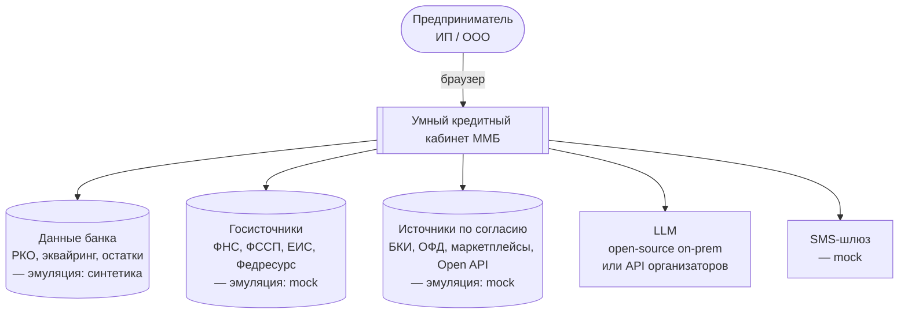
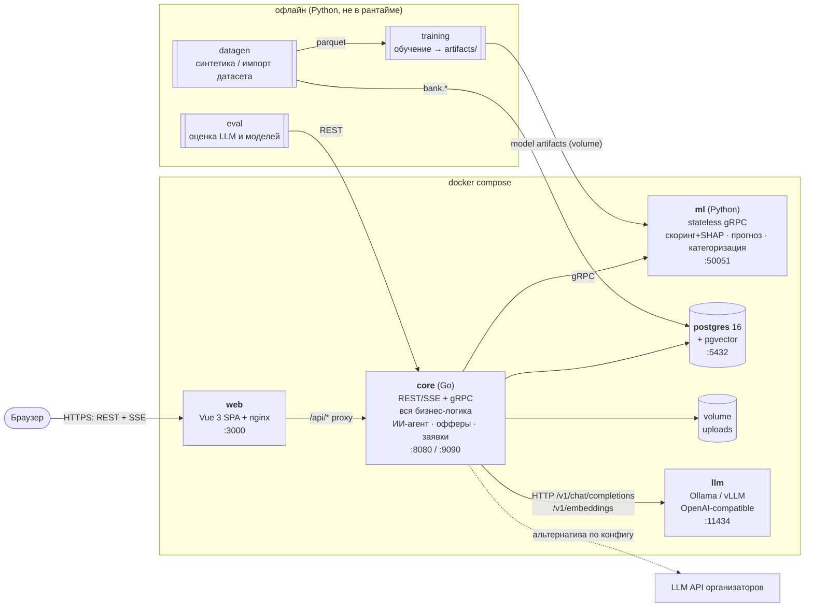
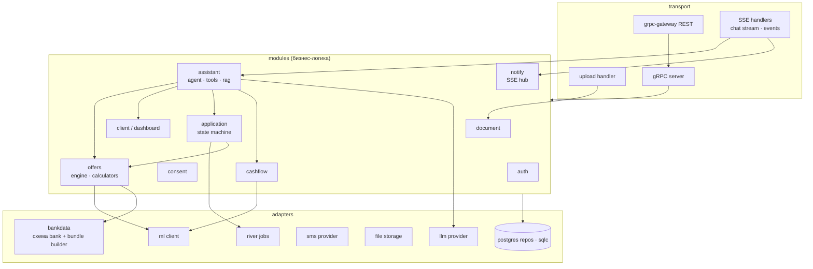

# Архитектура: обзор

## Цели архитектуры

| Атрибут качества | Почему важен | Как обеспечиваем |
|---|---|---|
| **Надёжность демо** | Защита одна, второй попытки не будет | Всё локально в docker compose, детерминированная синтетика, `make demo-reset`. Без LLM кабинет работает, кроме чата |
| **Скорость разработки командой 1 + 1 + 3** | 2 недели, один fullstack | Модульный монолит на Go, contract-first, кодогенерация (protoc, sqlc, openapi-typescript), конфиги вместо кода |
| **Объяснимость** | Банк, регулятор, жюри | Решения принимают модель и правила, LLM только объясняет. SHAP, трассировка инструментов |
| **Безопасность данных** | Банковская и налоговая тайна, 152-ФЗ | On-prem LLM по умолчанию, маскирование PII для внешних провайдеров, согласия |
| **Заменяемость** | Синтетика или датасет организаторов, своя LLM или их API | Источники данных и LLM за интерфейсами-адаптерами |

## Принципы

1. **LLM — интерфейс, а не решатель.** LLM понимает запрос, выбирает инструменты и формулирует ответ. Цифры, лимиты и решения дают детерминированный код и ML-модели.
2. **Вся бизнес-логика в Go, Python — только модели.** Python-сервис stateless: на вход данные, на выход предсказания. В БД не ходит, бизнес-правил не знает ([ADR-0003](adr/0003-go-logic-python-models.md)).
3. **Contract-first.** Все API описаны в `.proto`, генерация через `protoc` и локальные плагины (без buf). Из них генерируются Go-сервер, REST-шлюз, Python-сервер и TypeScript-типы для фронта.
4. **Один Postgres на всё.** Данные, очередь задач, OTP, векторный поиск. Ни Redis, ни брокеров ([ADR-0005](adr/0005-no-redis-no-broker.md)).
5. **Конфиг вместо кода.** Каталог продуктов, правила допуска, ценообразование, промпты, база знаний — файлы в репозитории.
6. **Всё поднимается одной командой** `docker compose up`.

## C4: уровень 1 — контекст

## C4: уровень 2 — контейнеры

### Контейнеры

| Контейнер | Технология | Ответственность | Владелец |
|---|---|---|---|
| `web` | Vue 3 + Vite, nginx | SPA. nginx отдаёт статику и проксирует `/api` в core: один origin, без CORS | Fullstack |
| `core` | Go, модульный монолит | Аутентификация, доступ к данным клиента, согласия, **подбор офферов и калькуляторы**, заявки и их пайплайн, документы, **ИИ-агент** (LLM, инструменты, RAG, guardrails), SSE | Fullstack + Junior |
| `ml` | Python, gRPC | **Только инференс моделей**: PD + калибровка + SHAP, вероятность одобрения (батч сценариев), прогноз cash flow, категоризация транзакций. Загружает артефакты из volume при старте | ML |
| `postgres` | PostgreSQL 16 + pgvector | Все данные, очередь River, векторный индекс базы знаний | Junior (миграции) |
| `llm` | Ollama (Mac — нативно вне Docker) / vLLM (Linux + GPU) | Генерация и эмбеддинги через OpenAI-совместимый API | ML (LLM) |
| `datagen` | Python CLI, профиль `seed` | Генерация синтетики или импорт датасета организаторов → схема `bank` + parquet для обучения | ML (данные) |

## Как общаются компоненты

| Откуда → куда | Протокол | Зачем |
|---|---|---|
| Браузер → core | REST/JSON (grpc-gateway) | Все обычные запросы |
| Браузер → core | SSE через `fetch` (POST) | Стрим ответа ассистента |
| Браузер → core | SSE (GET `/api/v1/events`) | Статусы заявок, уведомления |
| Браузер → core | `multipart/form-data` | Загрузка документов (отдельный HTTP-хендлер) |
| core → ml | gRPC (unary) | Скоринг, прогноз, категоризация. Данные клиента передаются в запросе (`ClientDataBundle`) |
| core → llm | HTTP, OpenAI Chat Completions (stream + tools), Embeddings | Агент и RAG |
| core → postgres | pgx (sqlc) | Данные; River — очередь задач |

Подробнее о REST и событиях: [api.md](../04-api/api.md). Сценарии по шагам: [flows.md](flows.md).

## Технологический стек

| Слой | Выбор | Почему |
|---|---|---|
| **Frontend** | Vue 3 + TypeScript + Vite, Pinia, Vue Router, TanStack Query (vue-query) | Стек команды. vue-query снимает ручное кэширование и рефетчи |
| | Tailwind CSS v4 + Reka UI (headless) | Быстро собрать дизайн из макетов без борьбы с UI-китом |
| | ECharts (vue-echarts) | Прогноз с коридором, графики платежей, sparkline |
| | openapi-typescript + openapi-fetch | Типы API генерируются из proto → OpenAPI |
| | @microsoft/fetch-event-source | SSE с POST-телом и заголовками |
| | markdown-it + DOMPurify | Markdown в сообщениях ассистента без XSS |
| **Backend** | Go 1.26+, grpc-go, grpc-gateway v2 | Требование стека |
| | protoc + protoc-gen-go / go-grpc / grpc-gateway / openapi (gnostic) | Генерация Go, REST-шлюза и OpenAPI v3 одной командой `make proto`. Работает офлайн, без buf.build ([ADR-0001](adr/0001-monorepo-contract-first.md)) |
| | pgx v5 + sqlc, goose | Типобезопасный SQL без ORM, понятный новичку |
| | River | Фоновые задачи (пайплайн заявки) поверх Postgres |
| | openai-go (с кастомным `base_url`) | Один клиент для Ollama, vLLM и большинства API |
| | expr-lang/expr | Правила допуска к продуктам в YAML |
| | pgvector-go, golang-jwt v5, log/slog, caarlos0/env | — |
| **ML** | Python 3.12, uv | Быстрый менеджер зависимостей, workspace |
| | grpcio | Сервер инференса по общим proto |
| | CatBoost, SHAP (или встроенные ShapValues CatBoost), scikit-learn | PD-модель, калибровка, TF-IDF + LogReg для категоризации |
| | polars / pandas, statsforecast (опционально) | Признаки, прогноз |
| | Faker (ru_RU), pandera | Синтетика и валидация датасетов |
| **LLM** | Семейство Qwen3 через Ollama / vLLM (выбор по eval) | Apache 2.0, хороший русский, tool calling |
| | bge-m3 (эмбеддинги) | Мультиязычный, есть в Ollama |
| **Данные** | PostgreSQL 16 + pgvector | Одна БД на всё |
| **Инфра** | docker compose (профили), nginx, Makefile | Демо на ноутбуке или VPS |

## Внутреннее устройство core

Ключевая идея: **инструменты ассистента — это обычные вызовы Go-модулей внутри процесса.** Агент вызывает тот же `offers.Engine`, что и экран «Кредиты», поэтому цифры в чате и на экранах всегда совпадают.

Подробно по модулям: [services.md](services.md).

## Путь в прод

Слайд для жюри: что меняется при переходе от хакатона к банку.

| Хакатон | Прод банка |
|---|---|
| Синтетика в схеме `bank` | DWH / витрины банка, feature store. Адаптер `bankdata` меняет реализацию |
| Mock ФНС, БКИ, ОФД, маркетплейсов | Реальные интеграции за теми же интерфейсами |
| Модульный монолит core | Выделение сервисов по нагрузке: assistant, offers, applications |
| River на Postgres | Kafka / корпоративная шина для событий заявок |
| Ollama на ноутбуке | vLLM-кластер on-prem с GPU, батчинг, мониторинг |
| Модели в volume | Model registry (MLflow), валидация моделей риск-менеджментом, мониторинг дрейфа |
| JWT + mock SMS | Корпоративный IAM, реальный SMS-шлюз, УКЭП для подписания |
| Логи slog | OpenTelemetry → централизованный стек логов и трейсов |

## Архитектурные решения (ADR)

| # | Решение |
|---|---|
| [0001](adr/0001-monorepo-contract-first.md) | Монорепозиторий и contract-first на protoc (без buf) |
| [0002](adr/0002-grpc-gateway-plus-sse.md) | REST через grpc-gateway, стриминг через SSE-хендлеры |
| [0003](adr/0003-go-logic-python-models.md) | Вся бизнес-логика в Go, Python — только инференс моделей |
| [0004](adr/0004-llm-provider-abstraction.md) | Абстракция LLM-провайдера, open-source по умолчанию |
| [0005](adr/0005-no-redis-no-broker.md) | Без Redis и брокеров: всё на Postgres |
| [0006](adr/0006-canonical-data-and-adapters.md) | Канонический формат данных и адаптеры источников |
| [0007](adr/0007-scoring-catboost-shap.md) | Скоринг CatBoost + SHAP, решение не принимает LLM |
| [0008](adr/0008-auth-phone-otp.md) | Вход по телефону + mock OTP, JWT в httpOnly cookie |
