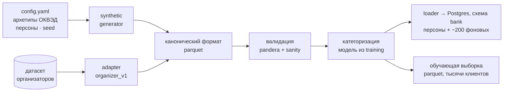

# Данные: синтетика и датасеты организаторов

Владелец: ML (данные). Код: `ml/packages/datagen` (Python, офлайн).

## Цели

1. **Реалистичность.** Графики на экранах и паттерны в выписке должны выглядеть как у настоящего бизнеса: сезонность, дни недели, зарплата 2 раза в месяц, налоги по календарю.
2. **Согласованность.** Транзакции, остатки, внешние источники и скрытый риск клиента не противоречат друг другу: если у клиента недоимка в ФНС, в выписке видна просрочка по ЕНП.
3. **Истории для демо.** Персоны со скриптованными событиями ([personas.md](../02-product/personas.md)).
4. **Обучаемость.** Достаточно фоновых клиентов с метками, чтобы обучить PD- и approval-модели и показать осмысленный SHAP.
5. **Воспроизводимость.** Фиксированный seed, конфиг в репозитории, `make data` даёт идентичный результат.

## Пайплайн



Команды:

```bash
make data                                    # синтетика → parquet → Postgres
make import DATASET=./data/org.csv ADAPTER=organizer_v1
make data-report                             # HTML-отчёт: распределения, примеры персон
```

## Канонический формат

Таблицы совпадают со схемой `bank` ([data-model.md](../03-architecture/data-model.md#схема-bank)): `clients`, `accounts`, `transactions`, `daily_balances`, `loans`, `ext_snapshots`, `ext_daily`, `counterparty_registry`, `meta`. Схемы описаны pandera-моделями в `datagen/canonical.py`, это и есть контракт для адаптеров.

## Генератор синтетики

### 1. Архетипы по ОКВЭД

`config.yaml` задаёт параметры отрасли. Значения сверить с открытыми отраслевыми данными (Росстат, отраслевые обзоры) и честно указать это на защите.

| Архетип | ОКВЭД | Выручка/мес (диапазон) | Сезонность (пик / спад) | Каналы | Себестоимость | ФОТ |
|---|---|---|---|---|---|---|
| Кофейня / общепит | 56.10, 56.30 | 0,5–3 млн | лето +15%, январь −20% | эквайринг 80–90%, СБП | 30–40% | 20–25% |
| Селлер | 47.91 | 1–10 млн | ноябрь–декабрь ×2 | выплаты WB / Ozon / ЯМ | 50–60% | 5–10% |
| Салон красоты | 96.02 | 0,3–1,5 млн | декабрь, март +20% | эквайринг, СБП | 15–25% | 35–45% |
| IT-студия | 62.01 | 1–5 млн | ровно, декабрь + | B2B-переводы | 10% | 50–60% |
| Автосервис | 45.20 | 1–4 млн | весна и осень + | эквайринг + B2B | 40% | 25% |
| Строительство | 41.20, 43.21 | 3–20 млн | лето +, зима − | B2B, госзаказ (УФК) | 55–65% | 20% |
| КФХ / агро | 01.13, 01.49 | 0,1–5 млн | авг–окт ×4, зима ×0,2 | B2B, оптовики | 40% | 15% |
| Пекарня / пищевое производство | 10.71 | 0,3–2 млн | ровно | эквайринг, B2B (кафе) | 35–45% | 25% |

Плюс у каждого архетипа: профиль по дням недели, средний чек, доля наличных (влияет на ОФД), налоговый режим, типичные контрагенты.

### 2. Скрытые факторы клиента

У каждого клиента генерируется латентный вектор, из которого выводится всё остальное:

| Фактор | Влияет на |
|---|---|
| `quality` (качество управления) | волатильность выручки, просрочки налогов, МФО, кассовые разрывы |
| `growth` | тренд выручки |
| `leverage` | число и размер кредитов (свой банк, другие банки, лизинг, МФО) |
| `formality` | доля безнала, наличие ОФД, транзит / снятия |
| `shock` (вероятность и момент) | падение выручки (потеря клиента, ремонт, сезон хуже обычного) |

### 3. Генерация операций (дневной шаг)

```
revenue[d] = base × trend(d) × season[month(d)] × weekday[dow(d)] × lognormal_noise × shock(d)
```

| Поток | Как эмитится |
|---|---|
| Эквайринг | **Одна транзакция в день** — возмещение от банка-эквайера на сумму карточной выручки за вчера минус комиссия |
| СБП | 1–3 агрегированные транзакции в день |
| B2B-покупатели | Счета с отсрочкой 0–90 дней по каждому покупателю, оплаты с назначением «Оплата по счёту № … от …» |
| Маркетплейсы | Еженедельные выплаты WB и Ozon (с удержаниями) |
| Госзаказ | Поступления от «УФК по …» по этапам контракта (согласованы с `ext_snapshots.eis`) |
| Поставщики | Закупки по циклу архетипа + сезонные предзакупки + **крупные регулярные** (квартальная закупка зерна у кофейни) |
| ФОТ | Аванс 20-го и зарплата 5-го, НДФЛ и взносы в составе ЕНП 28-го |
| Налоги | ЕНП 28-го числа по календарю режима (УСН — авансы поквартально, ПСН — по патенту) |
| Аренда | 1–5 числа, фиксированная сумма |
| Кредиты | Платежи по кредитам в нашем банке и **в других банках** (назначение «Погашение кредита по договору …», ИНН банка) |
| Лизинг | Платежи лизинговой компании |
| МФО | Только при низком `quality`: выдачи и погашения |
| Владелец | Переводы на личную карту (изъятие прибыли) |
| Наличные | Снятия при низком `formality` |

Остатки — кумулятивная сумма с начальным балансом. Правило: остаток не уходит ниже нуля, если нет овердрафта. Если уходит, генератор сдвигает необязательные платежи (так появляются реальные «кассовые разрывы»).

Назначения платежей генерируются по шаблонам с вариативностью (опечатки, сокращения), чтобы категоризатору было что учить. Названия и ИНН контрагентов берутся из `counterparty_registry` (синтетический справочник с валидными контрольными суммами ИНН).

### 4. Внешние источники

Генерируются из тех же скрытых факторов, поэтому согласованы с выпиской:

| Источник | Правило |
|---|---|
| `fns_open.tax_debt` | > 0, если в выписке были пропуски ЕНП (низкий `quality`) |
| `fssp` | Вероятность растёт при низком `quality` и наличии МФО |
| `bki` | Все кредиты из выписки + немного «невидимых» (кредитные карты, займы на физлицо) |
| `ofd` | Выручка ОФД = эквайринг + СБП + наличные (доля наличных по архетипу). **Поэтому подключение ОФД повышает лимит**: банк видит наличную выручку |
| `marketplace` | Только у селлеров: продажи > выплат (комиссии, логистика, возвраты) |
| `eis` | Только у строителей и части B2B: контракты, согласованные с поступлениями от УФК |
| `zsk` | `high` при высокой доле транзита и снятий наличных |

### 5. Метки для обучения

- **Дефолт (PD):** `default_12m ~ Bernoulli(σ(w · z + ε))`, где `z` — скрытые факторы, а не признаки. Веса `w` фиксируются в конфиге. После обучения проверяем: SHAP-важности согласуются с тем, как скрытые факторы проявляются в признаках. Это честный аргумент на защите.
- **Одобрение (approval):** синтетические исторические заявки (продукт, сумма, срок) × синтетическая политика андеррайтинга (пороги по PD, DSCR, стоп-факторы) + 5–10% шума («мнение андеррайтера»).
- Доля дефолтов ~5–8% (реалистично для ММБ). Классы не балансируем, калибровка решает.

### 6. Персоны

Персоны — тот же генератор, но параметры и **скриптованные события** заданы явно (`datagen/personas/*.yaml`):

```yaml
id: coffee_zerno
phone: "+79000000001"
archetype: coffee
client:
  legal_form: IP
  name: "ИП Смирнов Александр Игоревич"
  brand: "Кофейня «Зерно»"
  inn: "381205678912"
  okved_main: "56.30"
  registered_at: 2024-03-14
  tax_regime: USN6
  employees: 6
latent: { quality: 0.8, growth: 0.6, leverage: 0.3, formality: 0.85 }
revenue: { base_month: 1_090_000, growth_last_quarter: 0.18 }
events:
  - { date: 2026-07-01, type: revenue_level_shift, value: +0.18, note: "открыли летнюю веранду" }
  - { date: 2026-09-15, type: payment, counterparty: equipment_supplier_1, amount: 180_000, purpose: "Предоплата 10% по счёту 112 за кофемашину" }
  - { date: 2026-10-25, type: recurring_bulk_purchase, counterparty: coffee_beans_1, amount: 450_000, period: quarterly }
  - { date: 2026-10-20, type: revenue_level_shift, value: -0.15, note: "закрытие веранды" }
expected:                       # golden для интеграционного теста
  top_offers: [equipment_loan, leasing, overdraft]
  signals: [revenue_growth, prepay_equipment_supplier, cash_gap]
  cash_gap: { date_between: [2026-10-27, 2026-10-31], amount_between: [120_000, 250_000] }
```

> События с датой позже `DEMO_TODAY` (как закупка 25.10) в транзакции **не попадают**. Они нужны, чтобы в истории были аналогичные события прошлых кварталов: так прогноз «найдёт» регулярный платёж.

## Датасеты организаторов

Интерфейс адаптера:

```python
class DatasetAdapter(Protocol):
    name: str
    def load(self, path: Path) -> CanonicalBundle: ...   # вернуть канонические таблицы (часть может быть пустой)
```

| Что дали организаторы | Что делает адаптер |
|---|---|
| **Только агрегаты** (ОКВЭД, обороты мес/год, остаток, выручка, кредитная нагрузка) | Маппинг в `clients` + помесячные агрегаты. Затем **условная досинтезация**: генератор строит транзакции так, чтобы помесячные суммы совпадали с данными организаторов (обороты = Σ поступлений, выручка = Σ выручки, нагрузка → платежи по кредитам). Флаг `meta.tx_synthesized=true` |
| Транзакции | Маппинг колонок, категоризация, расчёт остатков, если их нет |
| Метки (дефолт / одобрение) | Переобучение моделей на реальных метках через тот же `training` |

Валидация адаптера: pandera-схема + проверки инвариантов (выручка ≤ обороты, остаток согласован с потоками, даты в окне).

## Объёмы

| Набор | Клиенты | Где |
|---|---|---|
| Персоны | 8 | Postgres + parquet |
| Фон для UI (листать, отлаживать) | ~200 | Postgres + parquet |
| Обучающая выборка | 5 000–10 000 | Только parquet (5–10 млн транзакций, polars справляется) |

## Проверка качества синтетики

- `make data-report`: распределения выручки по архетипам, примеры графиков персон, доля дефолтов, корреляции факторов.
- Инварианты (pytest): у каждого клиента есть зарплата и налоги по календарю; остатки ≥ 0 без овердрафта; ИНН валидны; события персон присутствуют.
