# Движок офферов (Go)

> Документ лежит в `05-ml/`, потому что это мост между моделями и продуктом. **Код — Go**: `backend/internal/modules/offers` ([ADR-0003](../03-architecture/adr/0003-go-logic-python-models.md)). Модели дают риск и вероятности, движок решает, что, сколько и под какой процент предложить.

## Пайплайн

```mermaid
flowchart LR
  inp["bundle + метрики<br/>согласия · цель"] --> sig["Сигналы"]
  sig --> stop["Стоп-факторы<br/>expr-правила"]
  stop --> lim["Лимиты<br/>платёжеспособность"]
  lim --> price["Ставка"]
  price --> calc["Калькулятор<br/>платёж · график"]
  calc --> score["ml.Score<br/>батч сценариев"]
  score --> rank["Ранжирование<br/>бейджи"]
  rank --> tips["What-if<br/>как повысить шанс"]
  tips --> out["Offer + причины<br/>+ недоступные продукты"]
```



Конфиги (меняются без перекомпиляции):

| Файл | Что внутри | Владелец |
|---|---|---|
| `config/products.yaml` | Каталог, правила допуска, сигналы ([пример](../01-research/products.md#как-каталог-хранится-в-коде)) | Fullstack + ML |
| `config/pricing.yaml` | Спреды, премии за риск, скидки, лимитные коэффициенты, веса ранжирования | ML-2 |
| `config/gov_programs.yaml` | Параметры госпрограмм | ML-2 (сверить с corpmsp.ru) |
| `config/feature_texts.yaml` | Тексты факторов | ML-2 |

## 1. Сигналы

Считаются в Go из бандла и агрегатов. Каждый — функция `func(b *Bundle) (fired bool, strength float64, evidence string)`. `evidence` идёт в «Почему именно он» и в режим прозрачности.

| Сигнал | Условие (по умолчанию) | Evidence (пример) |
|---|---|---|
| `cash_gap` | прогноз p50 уходит ниже буфера в горизонте 45 дней | «29 октября остаток −180 000 ₽» |
| `low_balance` | `low_balance_days_3m ≥ 10` | «12 дней в месяц остаток ниже 10% расходов» |
| `revenue_growth` | `revenue_growth_qoq ≥ 0.15` | «+18% за квартал» |
| `prepay_equipment_supplier` | `has_equipment_supplier_prepay` | «15.09 предоплата 180 000 ₽ ООО «КофеТех»» |
| `marketplace_seller` | `share_marketplace ≥ 0.3` | «70% выручки — выплаты WB» |
| `gov_contracts` | `eis_active_to_revenue > 0` или `share_gov ≥ 0.2` | «2 активных контракта по 44-ФЗ на 6,4 млн ₽» |
| `b2b_deferral` | `share_b2b ≥ 0.4` и средняя отсрочка ≥ 30 дней | «Покупатели платят в среднем через 42 дня» |
| `seasonal` | `seasonality_strength ≥ 0.4` или `revenue_cv_12m ≥ 0.25` | «Пик выручки в августе ×3,8» |
| `priority_okved` | ОКВЭД в списке программы + категория МСП | «ОКВЭД 62.01 — приоритетная отрасль» |
| `osn_vat` | `tax_regime = OSN` и `legal_form = OOO` | «Вычет НДС в лизинге» |
| `young_business` | `business_age_months < 9` | «Бизнесу 4 месяца» |

## 2. Стоп-факторы

Два уровня: **глобальные** (ничего не предлагаем, кроме нулевых продуктов) и **продуктовые** (`eligibility` в `products.yaml`). Правила на [expr-lang](https://expr-lang.org/), вычисляются над структурой `Env{Profile, Metrics, Risk, Signals, Goal}`.

```yaml
# config/pricing.yaml → global_stop
- expr: "Risk.Bankrupt"
  reason: "Процедура банкротства"
- expr: "Risk.FnsBlocked"
  reason: "Операции по счёту приостановлены ФНС"
- expr: "Risk.ZskLevel == 'high'"
  reason: "Высокий уровень риска по данным Банка России"
- expr: "Risk.FsspTotalKop > Metrics.RevenueAvg3mKop * 0.5"
  reason: "Крупная задолженность по исполнительным производствам"
```

Мягкие факторы (МФО, недоимка, просрочки по БКИ) **не стопают**: они идут в модель и снижают вероятность. Так работает «ответственный отказ с планом».

## 3. Лимиты (платёжеспособность)

```
FCF          = консервативный FCF = min(fcf_avg_6m, fcf_avg_12m);
               для сезонных — 25-й перцентиль помесячного FCF за 12 мес
DS_exist     = текущие платежи по долгам (наш банк + распознанные в выписке + БКИ, если есть согласие)
DS_max       = min( FCF / dscr_min , revenue_avg_6m × max_ds_to_revenue )
P_new_max    = max(0, DS_max − DS_exist)                   ← максимальный новый платёж

limit_afford = PV(P_new_max, rate, term)                   ← аннуитет: P × (1 − (1+r)^−n) / r
limit_rev    = revenue_avg_12m × unsecured_months[grade]   ← только для беззалоговых
limit        = floor_10k( min(limit_afford, limit_rev, product.max) ), если ≥ product.min, иначе продукт недоступен
```

| Параметр | По умолчанию | Смысл |
|---|---|---|
| `dscr_min` | 1,25 | FCF должен покрывать все платежи с запасом 25% |
| `max_ds_to_revenue` | 0,35 | Платежи по долгам ≤ 35% выручки |
| `unsecured_months` | A: 3, B: 2,5, C: 2, D: 1, E: 0 | Беззалоговый лимит в месяцах выручки |
| `payment_warning_share` | 0,30 | Предупреждение, если новый платёж > 30% FCF |

**Проверка на кофейне:** выручка 1,284 млн, FCF ≈ 293 тыс. ₽, текущие платежи 150 тыс. → `DS_max = 293/1,25 ≈ 234 тыс.` → `P_new_max ≈ 84 тыс.` → до ~2,4 млн на 36 мес. или до ~3,3 млн на 60 мес. Порядок сходится с макетом («доступно до 3 500 000 ₽», платёж ~71 тыс. за 2 млн). Точные цифры подгоняются параметрами персоны в синтетике и `pricing.yaml`.

Особые продукты:

| Продукт | Лимит |
|---|---|
| `overdraft` | `min(0,5 × revenue_avg_6m, product.max) × grade_mult`. Отдельно — **рекомендуемый** размер под найденный разрыв |
| `marketplace_loan` | `0,5 × avg(revenue_marketplace, 6m) × grade_mult` |
| `factoring` | `avg(revenue_b2b) × (средняя отсрочка / 30) × 0,9` |
| `bank_guarantee` | По сумме контракта из ЕИС, не выше `contract_share_max` |
| `leasing` | Стоимость предмета − аванс; аванс по грейду (A 0–10%, C 20%, D 30%); платёж проверяется тем же `P_new_max` |
| `umbrella_guarantee` | Не продукт, а модификатор: необеспеченная часть кредита уменьшается на долю поручительства (до 50%) → `limit_rev` растёт |

## 4. Ставка

```
rate_bp = key_rate_bp + product.spread_bp + grade_premium_bp[grade]
          − collateral_discount_bp (если залог или предмет лизинга)
          − Σ data_discount_bp (за каждый подключённый источник Tier 3, но не больше cap)
rate_bp = clamp(rate_bp, product.floor_bp, product.cap_bp)
```

```yaml
# config/pricing.yaml (фрагмент; цифры — демо)
key_rate_bp: 0              # ← выставить актуальную ключевую ставку перед демо
grade_premium_bp: { A: 0, B: 100, C: 250, D: 450, E: 800 }
data_discount_bp: { bki: 25, ofd: 50, marketplace: 50, fns_tax_secret: 25, openapi_bank: 50 }
data_discount_cap_bp: 100
ranking_weights: { fit: 0.45, approval: 0.35, cost: 0.20 }
```

**Господдержка:** если `priority_okved` и программа доступна, ставка берётся из формулы программы в `gov_programs.yaml` (например «ключевая − 350 bp», с полом). `savings_vs_market_kop` = Σ платежей по рыночной ставке − Σ платежей по льготной за весь срок.

## 5. Калькуляторы

Пакет `offers/calc`: чистые функции, деньги в копейках, ставка в bp, округление до копейки, последний платёж закрывает остаток.

| Тип | Формула |
|---|---|
| Аннуитет | `P = S · r / (1 − (1 + r)^−n)`, `r = rate / 12` |
| Дифференцированный | `основной = S / n`, проценты на остаток |
| **Сезонный** | Веса месяцев `w_m` = сезонный индекс выручки клиента (обрезан до [0,5; 1,5], среднее = 1). Платёж `P_m = s · w_m`, где `s = S / Σ w_m · (1+r)^−m`. Проверка: каждый `P_m ≥` процентов за месяц, иначе веса поднимаются |
| Овердрафт | Проценты только за дни использования: `сумма × ставка × дни / 365` |
| Лизинг (упрощённо) | Аванс + равные платежи + выкупной. Для ООО на ОСН — эффект вычета НДС (ставка из конфига `VAT_RATE`) |

Эталонные тесты (table-driven): `2 000 000 ₽, 16,5%, 36 мес → 70 808,77 ₽/мес` (`7 080 877` коп.), переплата 549 115,72 ₽; сумма всех сезонных платежей дисконтируется ровно в `S`.

## 6. Скоринг сценариев

Для каждого допустимого продукта Go формирует `Scenario` (вид продукта, сумма = min(запрошенная, лимит), срок, **рассчитанный** платёж, лимит) и шлёт все сценарии одним `ml.Score`. Ответ: PD, грейд, `approval_prob`, SHAP. Грейд из ответа нужен для ставки, поэтому порядок такой: (1) клиентский скор без продукта → грейд → ставки и лимиты, (2) батч продуктовых сценариев → `approval_prob`. Это два вызова по ~50 мс.

## 7. Ранжирование и бейджи

```
fit    = goal_match (1.0, если purpose ∈ product.purposes) + Σ strength(сигналов продукта) · вес из матрицы
cost   = 1 − нормированная эффективная ставка (по min-max среди кандидатов)
score  = w_fit · fit_norm + w_approval · approval_prob + w_cost · cost
```

- Топ-3 с разнообразием: не больше одного продукта каждого `kind`.
- Бейджи: первый — `BEST`; программа господдержки — `GOV_SUPPORT`; без цели (проактивно) — `PREAPPROVED`; остальные — `ALTERNATIVE`.
- `fit_reasons` — evidence сработавших сигналов + «целевое использование под …».
- Недоступные продукты возвращаются с причинами (`unavailable[]`): ассистент объясняет, «почему не лизинг».

## 8. What-if и «как повысить шанс»

1. Кандидаты рычагов по ситуации:
   - сумма > лимита или `approval_prob < 0,8` → **уменьшить сумму** (бинпоиск по сумме: 5 сценариев за один батч);
   - платёж > `payment_warning_share` → **увеличить срок**;
   - есть неподключённые источники → **подключить источник** (`assume_sources`, оценка «до»);
   - есть недоимка / ФССП / МФО → **погасить** (`assume.*_repaid`);
   - сумма > беззалогового лимита и клиент в реестре МСП → **зонтичное поручительство**.
2. Батч-скоринг всех рычагов.
3. Оставляем рычаги с `Δapproval ≥ 5 п.п.` или `Δrate ≤ −25 bp` или `Δlimit ≥ 10%`. Топ-3 по эффекту → `tips[]` с deeplink-действием.

## Кассовый разрыв → овердрафт

Модуль `cashflow`, вход — ответ `ml.Forecast`:

```
buffer      = 5% среднемесячных расходов
gap_date    = первый день t в горизонте, где balance_p50[t] < buffer
gap_amount  = buffer − min_t balance_p50[t]
risk_only   = balance_p50 ≥ buffer, но balance_p10 < 0 → «возможен разрыв» (мягкий алерт)
causes      = регулярные платежи за 7 дней до gap_date (по сумме) + падение выручки к прошлому месяцу > 10%
suggestion  = overdraft на ceil_10k(gap_amount × 1,2), не больше лимита овердрафта;
              если овердрафт недоступен → revolving_line → credit_card
```

## Политика решения по заявке

Используется в `application.decide` ([flows.md](../03-architecture/flows.md#5-отправка-заявки-и-решение)):

| Условие | Решение |
|---|---|
| Сработал стоп-фактор | `DECLINED` + причина |
| `amount > AUTO_DECISION_LIMIT` (10 млн) | `MANUAL_REVIEW` (в демо — таймер «андеррайтер», затем по правилам ниже) |
| `approval_prob ≥ cutoff[product]` и `amount ≤ limit` | `APPROVED`: ставка и платёж из движка |
| `amount > limit ≥ product.min` и `approval_prob(limit) ≥ cutoff` | `COUNTER_OFFER` на `limit` |
| Иначе | `DECLINED` + `tips[]` |

`cutoff` по умолчанию 0,5 (в `pricing.yaml` по продуктам). Решение детерминировано при одинаковых данных и версии модели. Всё пишется в `score_log` и `application_events`.

## Тесты

- Калькуляторы: эталонные значения, свойства (сумма основного долга = S, платежи ≥ процентов).
- Правила: table-driven тесты expr-выражений на фикстурах.
- **Golden-тест персон**: для каждой персоны топ-3 офферов, сработавшие сигналы и разрыв совпадают с `personas/<id>.expected.yaml` (на `mlclient.fake` с фиксированными скорами и на реальном `ml`).
