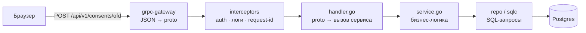

# Онбординг: junior backend

Привет! Здесь всё, чтобы с первого дня приносить пользу и не утонуть. Твоя зона — **понятные, изолированные модули Go-бэкенда**: авторизация, согласия, уведомления, документы, слой данных. Каждая задача ниже имеет чёткий критерий «готово».

## День 0: окружение (≈ 2 часа)

- [ ] Установить Docker, Go 1.26+, VS Code или GoLand (с Go-плагином)
- [ ] Склонировать репозиторий, выполнить [быстрый старт](local-setup.md#быстрый-старт)
- [ ] Открыть http://localhost:3000 и войти как кофейня
- [ ] Прочитать: [vision](../00-overview/vision.md) (10 мин), [overview](../03-architecture/overview.md) (20 мин), [services → core](../03-architecture/services.md#core-go) (15 мин), [conventions](conventions.md) (10 мин)
- [ ] Если Go впервые: [Tour of Go](https://go.dev/tour/) (разделы Basics, Methods & Interfaces, Concurrency) и [Go by Example](https://gobyexample.com/)

## Как запрос проходит через бэкенд



- **gateway** превращает HTTP/JSON в gRPC-вызов. Его код генерируется, руками не пишем.
- **handler** — тонкий: достаёт `client_id` из контекста, вызывает сервис, превращает результат в proto.
- **service** — логика и валидация.
- **repo** — SQL-запросы, Go-код к ним генерирует sqlc.

## Рецепт: новый эндпоинт от proto до curl

На примере `POST /api/v1/consents/{source}`.

**1. Описать в proto** (`proto/alfa/core/v1/consent.proto`):

```proto
rpc GrantConsent(GrantConsentRequest) returns (GrantConsentResponse) {
  option (google.api.http) = { post: "/api/v1/consents/{source}" body: "*" };
}
message GrantConsentRequest { string source = 1; }
message GrantConsentResponse { DataSource source = 1; OfferDelta delta = 2; }
```

**2. Сгенерировать код:** `make proto` → в `backend/gen/alfa/core/v1/` появятся интерфейс сервера и регистрация в gateway.

**3. Написать SQL** (`backend/queries/consent.sql`) и `make sqlc`:

```sql
-- name: UpsertConsent :one
INSERT INTO core.consents (client_id, source, status, scope, granted_at)
VALUES ($1, $2, 'granted', $3, now())
ON CONFLICT (client_id, source) DO UPDATE
  SET status = 'granted', scope = EXCLUDED.scope, granted_at = now(), revoked_at = NULL
RETURNING *;
```

**4. Логика в сервисе** (`internal/modules/consent/service.go`):

```go
func (s *Service) Grant(ctx context.Context, clientID uuid.UUID, source string) (Consent, error) {
    if !IsKnownSource(source) {
        return Consent{}, ErrUnknownSource
    }
    row, err := s.q.UpsertConsent(ctx, db.UpsertConsentParams{ClientID: clientID, Source: source, Scope: defaultScope(source)})
    if err != nil {
        return Consent{}, fmt.Errorf("consent: upsert: %w", err)
    }
    s.audit.Log(ctx, clientID, "consent.granted", map[string]any{"source": source})
    s.offers.Invalidate(clientID)
    return fromRow(row), nil
}
```

**5. Тонкий handler** (`internal/modules/consent/handler.go`):

```go
func (h *Handler) GrantConsent(ctx context.Context, req *corev1.GrantConsentRequest) (*corev1.GrantConsentResponse, error) {
    clientID, err := auth.ClientID(ctx) // ТОЛЬКО из контекста, никогда из запроса
    if err != nil {
        return nil, status.Error(codes.Unauthenticated, "no session")
    }
    c, err := h.svc.Grant(ctx, clientID, req.GetSource())
    if errors.Is(err, ErrUnknownSource) {
        return nil, status.Errorf(codes.InvalidArgument, "unknown source %q", req.GetSource())
    }
    if err != nil {
        return nil, err
    }
    return &corev1.GrantConsentResponse{Source: toProto(c)}, nil
}
```

**6. Зарегистрировать** handler в `internal/app` (рядом с остальными, по образцу).

**7. Проверить руками** (`backend/http/consent.http` или curl):

```bash
curl -i -X POST localhost:8080/api/v1/consents/ofd -H 'X-Requested-With: fetch' -b 'session=<cookie из браузера>' -d '{}'
```

**8. Тест** на сервис: table-driven, неизвестный источник → ошибка, повторное согласие → обновление.

## Рецепт: миграция

```bash
make migrate-new NAME=create_consents
```

Откроется `backend/migrations/<timestamp>_create_consents.sql` с секциями `-- +goose Up` / `-- +goose Down`. Миграции применяются при старте core.

## Твои задачи

Порядок важен: сверху вниз. Оценки в днях с запасом.

| ID | Задача | Готово, когда… | Оценка |
|---|---|---|---|
| J1 | **Скелет инфраструктуры** (с fullstack): `deploy/docker-compose.yml`, `Makefile`, `.env.example`, миграции схем `core` и `bank` | `make up` поднимает Postgres, core и web; миграции применяются; `make down` чистит | 1,5 |
| J2 | **Модуль `auth`**: OTP (генерация, хэш, TTL, попытки, лимит запросов), mock SMS (`sms_outbox`), JWT в cookie, middleware `auth.ClientID(ctx)`, `GetMe`, `ListDemoPersonas` | Вход по демо-номеру работает из UI. 4-я неверная попытка блокирует. Без cookie защищённые методы отдают 401 | 2 |
| J3 | **Адаптер `bankdata`, часть 1**: sqlc-запросы к `bank.*` (профиль, помесячные агрегаты по категориям, дневные ряды, долги, снимки источников) | Для кофейни запросы возвращают цифры, совпадающие с отчётом `make data-report` | 1,5 |
| J4 | **Адаптер `bankdata`, часть 2**: `BuildBundle(clientID, consentMask, asOf)` по контракту `ClientDataBundle` (пара с ML-1) | **Контрактный тест** зелёный: бандлы персон из Go совпадают с golden-JSON от Python | 1,5 |
| J5 | **Модуль `consent`**: список источников, выдать и отозвать согласие, маска для `bankdata`, аудит | Подключение ОФД в UI меняет маску. Отзыв убирает источник из бандла | 1 |
| J6 | **Модуль `notify`**: SSE-хаб `GET /api/v1/events` (heartbeat 15 с, `Last-Event-ID`, буфер 100 событий на клиента) | Две вкладки одного клиента получают событие. Переподключение досылает пропущенное | 1 |
| J7 | **Заявки (с fullstack)**: CRUD черновика, `application_events` и таймлайн, OTP-подписание, задача `disburse` (транзакция выдачи в `bank`) | После подписания на дашборде вырос остаток, в таймлайне все шаги с временем | 2 |
| J8 | **Модуль `document`**: `POST /documents` (multipart, ≤ 10 МБ, белый список MIME, проверка сигнатуры), хранение в volume, список, скачивание | Загрузка PDF из мастера заявки. `.exe`, переименованный в `.pdf`, отклоняется | 1 |
| J9 | **`audit` + `demo-reset`**: журнал действий; `POST /demo/reset` и `make demo-reset` | Сброс за ≤ 10 с возвращает демо-мир к исходному виду | 0,5 |
| J10 | **Коллекция API-тестов**: `.http`-файлы (или hurl) на все публичные эндпоинты + смоук-скрипт | `make smoke` проходит на чистом стенде | 1 |

## Правила, которые сэкономят тебе время

1. **Застрял больше чем на 30 минут — спроси.** Это не слабость, а экономия общего времени.
2. Никаких push в `main`: только ветка и PR. PR маленькие (одна задача или её часть).
3. Перед PR: `make test` и `make lint`.
4. `client_id` всегда из контекста. Если пишешь эндпоинт, который принимает `client_id` в запросе, остановись и спроси.
5. Деньги — `int64` в копейках, никогда `float64`.
6. Не трогай сгенерированный код (`gen/`, `internal/db/`): правь источник (proto или SQL) и перегенерируй.

## Шпаргалка

| Команда | Что делает |
|---|---|
| `make up` / `make logs` | Поднять стек / смотреть логи |
| `make dev-core` | Запустить core локально с перезапуском |
| `make proto` / `make sqlc` | Перегенерировать код |
| `make migrate-new NAME=x` | Новая миграция |
| `make test` | Все тесты |
| `docker compose -f deploy/docker-compose.yml exec postgres psql -U alfa` | Консоль БД |

## Полезные ссылки

- [Effective Go](https://go.dev/doc/effective_go)
- [grpc-gateway: документация](https://grpc-ecosystem.github.io/grpc-gateway/)
- [sqlc + pgx](https://docs.sqlc.dev/en/latest/tutorials/getting-started-postgresql.html)
- [River: очередь задач на Postgres](https://riverqueue.com/docs)
- [goose: миграции](https://github.com/pressly/goose)
- [MDN: Server-Sent Events](https://developer.mozilla.org/en-US/docs/Web/API/Server-sent_events/Using_server-sent_events)
