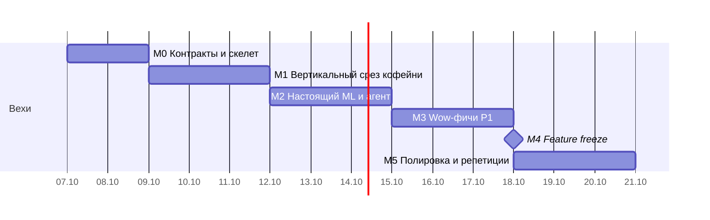
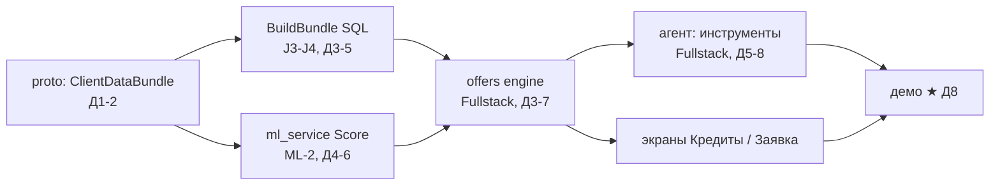

# Roadmap

Точная дата защиты пока неизвестна (Q1 в [decisions.md](../00-overview/decisions.md)). План рассчитан на **14 дней**: Д1 — 07.10.2026. Ниже есть сжатый вариант на 7 дней.

> **Обновление 07.10.2026:** официальная разработка идёт **19–26 октября** (≈ 7 дней). Всё, что не зависит от чужих данных (proto, платформа core, калькуляторы, фейки, каркасы), делаем **до 19-го** как заготовку. К началу окна хотим иметь M0 закрытым и значительную часть M1; в окне ориентируемся на [сжатый вариант на 7 дней](#сжатый-вариант-7-дней).

## Вехи

| Веха | Дни | Цель | Критерий выхода |
|---|---|---|---|
| **M0. Контракты и скелет** | Д1–2 | Все работают параллельно | `make up` открывает экран входа. Proto v1 (bundle, offers, applications, chat events) смёржен. `mlclient.fake` отдаёт скоры. Синтетика кофейни в `bank.*` |
| **M1. Вертикальный срез «кофейня»** | Д3–5 | Тонкий, но сквозной путь | Вход → дашборд на реальных данных → офферы и калькулятор (движок v1 на фейковых скорах) → черновик → отправка → решение (фейк). Чат v0: текст + `find_offers` + виджет `offer_cards`. ML: все P0-персоны, категоризатор, PD v1 |
| **M2. Настоящий ML и агент** | Д6–8 | P0 полностью | Настоящие PD, approval и SHAP в `ml`. Прогноз и алерт разрыва. Агент со всеми P0-инструментами и guardrail чисел. SSE-таймлайн, подписание, выдача. **Блоки ★ из [demo-script](../02-product/demo-script.md) проходят от начала до конца.** Прогон демо Д8 |
| **M3. Wow P1** | Д9–11 | Отрыв от других команд | Согласия и рост лимита, «как повысить шанс», господдержка, сезонный график, извлечение данных из счёта, режим прозрачности, персона «Салон». Eval LLM и выбор модели |
| **M4. Feature freeze** | конец Д11 | Только баги | Golden-тесты персон зелёные. Новые фичи не берём |
| **M5. Полировка** | Д12–14 | Защита без сюрпризов | Полировка UI, прогрев LLM, офлайн-проверка, **3 полных репетиции**, запись видео, слайды |

## Приоритеты

| P0 (без этого демо нет) | P1 (вау) | P2 (если останется время) |
|---|---|---|
| Вход по OTP | Подключение источников, рост лимита | Голосовой ввод |
| Дашборд + проактивный баннер | «Как повысить шанс» (what-if) | Мобильная вёрстка |
| Алерт кассового разрыва + прогноз | Господдержка + экономия | Vision-модель для сканов |
| Чат: понимание цели → офферы (виджеты) | Сезонный график | Факторинг, гарантии в UI |
| Подбор и калькулятор | Счёт → автозаполнение + проверка поставщика | MLflow |
| Заявка: черновик → решение → подпись → деньги | Режим прозрачности | Отзывы с карт как признак |
| Объяснение решения (SHAP) | Персона «Салон» (ответственный отказ) | |
| Guardrail чисел | RAG по базе знаний | |

## Загрузка команды (P0 + P1)

| Человек | Объём задач, дней | Доступно, дней | Статус |
|---|---|---|---|
| Fullstack (Go + Vue) | ~20 (из них P0 ≈ 15,5) | 11 | 🔴 **Перегруз** |
| Junior (Go) | ~13 (с поправкой на опыт) | 11 | 🟡 На грани |
| ML-1 (данные) | ~9 | 11 | 🟢 |
| ML-2 (модели) | ~10 | 11 | 🟢 |
| ML-3 (LLM) | ~10,5 | 11 | 🟢 |

**Главный риск проекта — fullstack**: он делает весь фронт, движок офферов и агента. Варианты (решает капитан):

1. **Кто-то из ML берёт часть фронта** на TypeScript (это не Python, граница из ADR-0003 не нарушается): графики ECharts (`CashflowChart`, мини-графики платежей) и экран «Финансы бизнеса». Освобождает ~3 дня. *Рекомендуем: ML-1 после Д6, когда синтетика стабилизируется.*
2. **ML-3 готовит всё для агента, кроме Go-кода**: промпты, описания и JSON-схемы инструментов, база знаний, тексты виджетов, eval. Fullstack только склеивает.
3. **Junior забирает модули целиком** по [списку J1–J10](../06-dev/junior-onboarding.md#твои-задачи).
4. Если всё равно не успеваем — **режем P1 справа налево** по таблице приоритетов.

## Критический путь

Всё, что не на этом пути, делается параллельно на фейках: фронт — на моках API, движок — на `mlclient.fake`, ML — на parquet.

## Ритуалы

| Что | Когда | Зачем |
|---|---|---|
| Синк 15 минут | Ежедневно утром | Блокеры, что сегодня мёржим |
| Интеграция в `main` + смоук демо | Ежедневно до 18:00 | Не копить расхождения |
| Прогон демо целиком | Д8, Д11, Д13, Д14 | Ловить регрессии сценария |
| Обзор синтетики (графики персон) | Д5 | Проверить реалистичность до обучения моделей |

## Риски

| Риск | Вероятность | Влияние | Митигация |
|---|---|---|---|
| Fullstack не успевает | Высокая | Высокое | См. «Загрузка команды». Жёсткий P0, генерированный API-клиент, переиспользование виджетов |
| 8B-модель плохо вызывает инструменты | Средняя | Высокое | Eval с Д6, режим `router`, меньше инструментов, few-shot, модель побольше на GPU |
| Синтетика выглядит неправдоподобно | Средняя | Среднее | Отчёт `make data-report` и ревью Д5, параметры архетипов из открытых отраслевых данных |
| Бандл Go и Python расходятся | Средняя | Высокое | Контрактный тест (J4) с Д5 |
| Организаторы дадут датасет поздно | Средняя | Среднее | Адаптер и режим «только агрегаты» готовы заранее ([ADR-0006](../03-architecture/adr/0006-canonical-data-and-adapters.md)) |
| Не скачиваются образы и модели из РФ | Средняя | Высокое | Зеркала, предзагрузка, офлайн-проверка ([local-setup](../06-dev/local-setup.md#если-что-то-не-скачивается-из-рф)) |
| Сбой на защите | Низкая | Критическое | `make demo-reset`, прогретая LLM, видео как запасной план |

## Сжатый вариант (7 дней)

Если защита через неделю: M0 — Д1, M1 — Д2–3, M2 — Д4–5, полировка и репетиции — Д6–7. Из P1 оставляем только **режим прозрачности** и **персону «Салон»** (дёшево, но сильно на защите). Остальное P1 переносим в слайд «Roadmap продукта».
